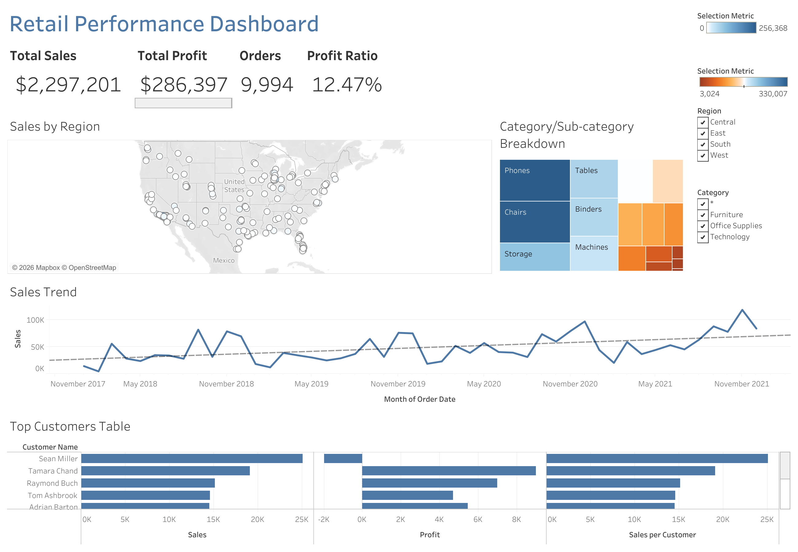

# Retail Performance Dashboard — Project Documentation

## 1. Problem Statement

A retail operations team needs a single view into how the business is performing across regions, product categories, and customers — without opening separate spreadsheets for sales totals, profit margins, and customer rankings. Specifically, three questions kept coming up:

- **Where** is the business winning or losing money geographically?
- **Which** product categories and sub-categories are profitable versus which ones are quietly dragging margins down despite decent sales volume?
- **Who** are the highest-value customers, and are they actually profitable to serve?

Static spreadsheet exports answer these questions once, for one moment in time, and require manual rebuilding every time someone wants to look at a different metric (e.g., swapping from "which regions sell the most" to "which regions are the most profitable"). There was no single, interactive source of truth.

## 2. Solution

An interactive Tableau Cloud dashboard that consolidates sales, profit, and customer data into one screen, built around a **parameter-driven metric toggle** so a single control — not five separate charts — lets a viewer switch what they're looking at (Sales, Profit, or Profit Ratio) across both the map and the category breakdown simultaneously.

The dashboard includes:

- **A KPI summary row** — Total Sales, Total Profit, Order Count, and Profit Ratio at a glance.
- **A geographic map** — city-level sales/profit performance, colored on a diverging scale so loss-making locations visually stand out in orange against profitable ones in blue.
- **A Category/Sub-Category treemap** — sized by sales volume, colored by the same diverging profitability scale, so a big box that's still orange flags a genuine problem area (e.g., Tables).
- **A sales trend line** — with a linear trend overlay, to separate real growth from month-to-month noise.
- **A Top 10 Customers table** — ranked by sales, with profit shown side-by-side to surface high-revenue customers who are actually unprofitable.
- **Interactive filters and actions** — Region and Category quick filters, plus a click-to-filter action so selecting a city on the map narrows down the rest of the dashboard.

## 3. Tech Stack

- Platform : Tableau Cloud (web-based authoring) 
- Data source : Sample – Superstore (built-in Tableau dataset) 

## 4. Project Process

1. **Connected** to the Sample – Superstore data source and reviewed field structure.
2. **Built calculated fields** needed for the analysis: Profit Ratio, a Discount Flag, and the Sales-per-Customer LOD expression.
3. **Built individual worksheets** one at a time: KPI tiles, a geographic map, a Category/Sub-Category treemap, a sales trend line, and a Top 10 Customers table.
4. **Added a parameter** (`Metric Selector`) and a supporting calculated field (`Selected Metric`) so the map and treemap could switch what they visualize without duplicating charts.
5. **Assembled the dashboard**, arranging the KPI row, map, treemap, trend line, and customer table into a structured layout using horizontal containers.
6. **Added interactivity**: Region and Category filters, plus a filter action so clicking a map point filters related charts.
7. **Iteratively debugged and refined** formatting, color scales, and data connections (see Section 5).
8. **Prepared for publishing** to Tableau Cloud with a defined refresh/permissions plan.

## 5. Key Challenges & Solutions

Building this dashboard surfaced several real debugging problems, which ended up being some of the most instructive parts of the project:

| Challenge | Resolution |
|---|---|
| Top Customers Table showed a single "Null" row instead of 10 named customers. The `Customer Name` field had been mistyped as a Measure instead of a Dimension, so it aggregated every customer into one null value | Converted the field back to a Dimension with a String data type, then rebuilt the view |
| Map and treemap legends wouldn't merge into one shared legend | Each sheet's color scale was set to "Automatic" Start/End, so they computed different numeric ranges even with identical palettes | Locked both sheets to the same fixed Start/End/Center values so the color domains matched exactly |

## 6. Key Outcomes

- A fully interactive, single-screen retail performance dashboard requiring no external tools to interpret sales, profit, and customer performance.
- A working parameter-driven metric toggle — a genuinely intermediate Tableau technique — that lets one control drive multiple charts simultaneously instead of requiring separate static views per metric.
- Concrete, real business insights surfaced directly by the build itself: certain sub-categories (e.g., Tables, Bookcases) generate sales but erode margin; the top customer by revenue is not the top customer by profit.

## 7. Possible Future Enhancements

- Add a Discount Impact Analysis view using the existing Discount Flag field.
- Add a Sales forecast overlay on the trend line.
- Introduce row-level security if extended to multiple regional stakeholders.
- Replace the manual "click empty space to reset" behavior with a dedicated reset mechanism using a dummy-sheet filter action trick.
